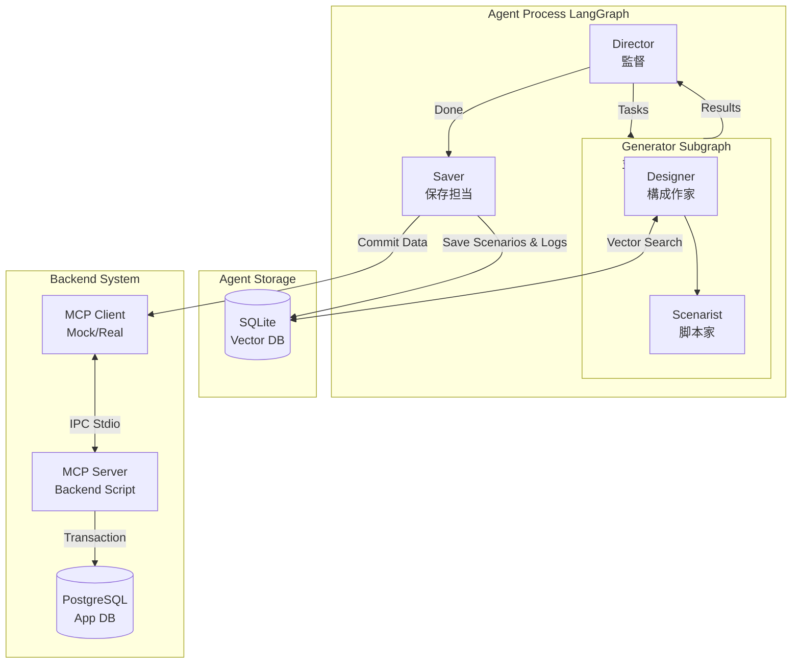

# AIデータ生成エージェント (ArtSquare) 要件定義

## 1. 概要

ArtSquareプラットフォーム（CtoCサービス）向けに、文脈の通ったリアルなテストデータ（ユーザー、プロジェクト、商品）を生成する自律型エージェント。単なるランダムデータではなく、**「シナリオ（コンセプト）」** に基づいた整合性のあるデータセットを作成し、データベース内のデータの多様性とリアリティを担保する。

## 2. アーキテクチャ (LangGraph Workflow)

エージェントは以下のノードによるパイプライン処理で構成される。

### Director (計画策定) ✅実装済

- ユーザーの入力（目標分布）に基づき、生成タスクの全体計画を策定する。
- カテゴリごとの不足数を計算し、並列処理用タスクを発行する。
- サイクルループ機能：生成完了後に再度状況を評価し、目標未達なら追加生成を行う。

### Generator Subgraph (並列生成) ✅実装済

Directorから発行されたタスクを並列処理するサブグラフ。以下の2つのノードで構成される。

1.  **Designer (コンセプト設計 & ベクトル検索)** ✅実装済
    - 生成シナリオ（例：「30代女性、北欧家具のリサイクル販売」）を設計する。
    - **Agent DB** をベクトル検索し、既存データと類似しすぎないコンセプトを作成（分布の調整）。
    - 生成するデータの「種（Seed）」となるコンセプトを出力。
2.  **Scenarist (詳細データ生成)** ✅実装済
    - コンセプトに基づき、具体的なJSONデータ構造（`ScenarioCluster`）を生成する。
    - ユーザー、プロジェクト、商品（Item）のフィールドを埋める。
    - 内部参照用の `tempId` を使用してリレーションを定義。

### Saver (保存 & ログ記録) ✅実装済

- 生成されたデータを **MCP Client** を通じて Backend API へ送信。
- 保存成功後、シナリオのベクトル埋め込みと、IDマッピング情報（ArtifactLog）を **Agent DB (SQLite)** に記録。
- **現状**: Backendへの送信、Agent DBへの保存ともに実装済み。

## 3. データ管理戦略

### A. Agent DB (SQLite) ✅実装済

エージェント専用の管理DB。`better-sqlite3` と `sqlite-vec` を直接使用して操作する。主な役割：

- **重複排除と分布調整**: 生成済みシナリオをベクトル化して保存し、検索可能にする。
- **ログ管理**: どの `tempId` が本番のどのIDになったかを記録。

**主要テーブル:**

- `scenarios`: コンセプトテキスト、メタデータ（JSON）。
- `scenarios_vec`: ベクトル検索用仮想テーブル（`vec0`, 768次元）。
- `artifact_logs`: 生成アーティファクトの記録（tempIdとrealIdの対応表）。

### B. Production DB (PostgreSQL)

ArtSquare本体のデータベース。`backend/prisma/schema.prisma` で定義。主な役割：

- アプリケーションデータの格納。

**アクセス制限:**

- エージェントは直接PostgreSQLに接続しない。
- データの整合性とバリデーションを保証するため、必ず **MCP Server** を経由して書き込みを行う。

## 4. システム連携 (MCP: Model Context Protocol)

### Backend MCP Server ✅実装済

- **場所**: `backend/scripts/mcp-server.ts`
- **機能**:
  - `save_scenario_cluster`: データの一括保存。
  - `cleanup_test_data`: 生成データの削除。
- **役割**:
  - JSONデータのバリデーション。
  - データベースへのトランザクション保存。
  - `tempId` の解決と本番IDの発行。
  - `publicId` (ユニーク制約) の衝突回避ロジック。
  - 不足項目の自動補完（デフォルト画像、公開ステータス、BlockNote形式への変換など）。
  - S3への画像アップロード（デフォルト画像）。

### Agent MCP Client ✅実装済

- **場所**: `agent/src/utils/mcp-client.ts`
- **現状**: `@modelcontextprotocol/sdk` を使用して本実装済み。
- **実装内容**:
  - Backendのスクリプトをサブプロセスとして起動し、Stdio経由でツールを実行する。
  - 環境変数の継承により、DB接続を確立。
  - `saveScenarioCluster` および `cleanupTestDataByIds` メソッドを提供。

## 5. 技術スタック

- **Language**: TypeScript
- **Agent Framework**: LangGraph
- **LLM & Embeddings**: Google Gemini (`gemini-2.0-flash-exp`)
- **Database**:
  - Agent: SQLite (better-sqlite3 + sqlite-vec)
  - Backend: PostgreSQL (Prisma v7)
- **Integration**: MCP (Model Context Protocol) SDK
