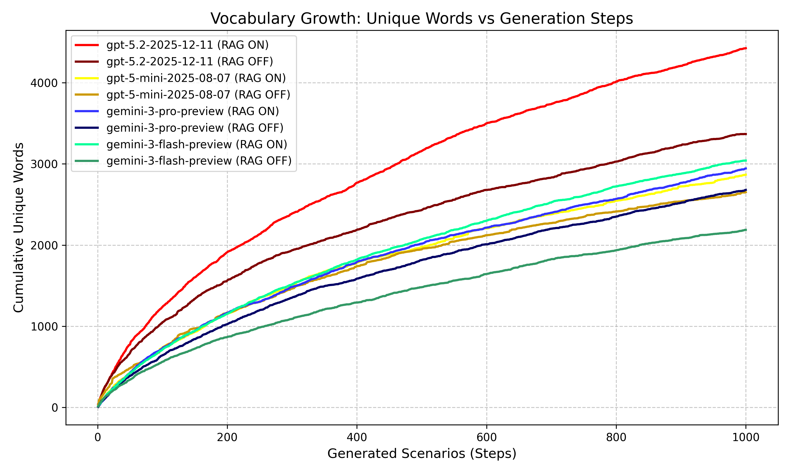
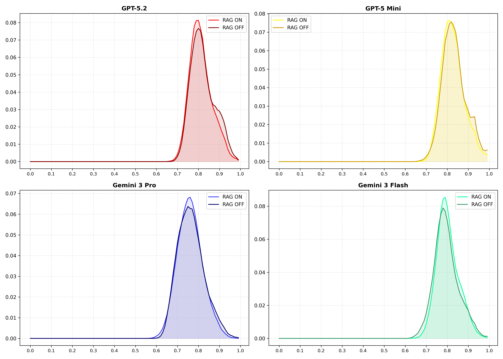

<!-- _class: title-slide -->

# 一点物売買プラットフォームの動作検証を目的とした

# 社会的シナリオに則ったデータ生成エージェントの開発

 

**指導教員: 植松 幸生 准教授**

 
 

**東京理科大学 創域理工学部 情報計算科学科**
**6322087 三笠 悠太郎**

2026/02/09

<!--
1. タイトルスライド (0:00 - 0:30)

ただいまご紹介にあずかりました、東京理科大学 創域理工学部 情報計算科学科の三笠です。
「一点物売買プラットフォームの動作検証を目的とした社会的シナリオに則ったデータ生成エージェントの開発」という題目で発表させていただきます。
よろしくお願いいたします。
-->

---

# 1. 背景: クリエイターエコノミーと「文脈」

- **クリエイターエコノミーの拡大**
  - 個人が創作物を発信・販売する市場（BOOTH, minne等）。
  - 物理的な作品（フィギュア、工芸品）の流通も活発化。

- **既存プラットフォームの課題**
  - **「商品」としての扱い**: スペックと価格が重視されがち。
  - **文脈の欠落**: 「なぜ作ったか」「どんなコミュニティで生まれたか」という**物語性**が保存されない。
  - **複雑な権利関係**: 共同制作やイベント主催者への収益分配など、複雑な関係性をシステムで表現しきれていない。

**→ 「作品の文脈」や「社会的関係性」を保存できるCtoC基盤が必要**

<!--
2. 研究背景: クリエイターエコノミーと「文脈」 (0:30 - 1:30)

まず、研究の背景についてお話しします。
近年、クリエイターエコノミーの拡大に伴い、個人が自身の創作物を発信・販売する市場が急速に成長しています。特に、フィギュアや工芸品といった物理的な一点物作品の流通も活発化しています。

しかし、既存のプラットフォームには課題があります。
多くの場合、作品はスペックや価格のみで比較される「商品」として扱われがちです。
一点物作品において本来価値の源泉となる、「なぜ作ったのか」「どのようなコミュニティで生まれたのか」といった「文脈」や「物語性（ナラティブ）」が、システム上で十分に保存・表現されていないのが現状です。
また、共同制作やイベント運営など、クリエイター間の複雑な社会的関係性や収益分配をサポートする機能も不足しています。

そこで、作品の「文脈」や「社会的関係性」を構造化して保存できる、新しいCtoCプラットフォームが必要とされています。
-->

---

# 2. 開発上の課題: 「テストデータがない」

文脈を重視するプラットフォームの開発には、**「文脈を持ったデータ」**での検証が不可欠。

- **従来のテストデータ生成手法の限界**
  - **ランダム生成 (Faker.js等)**: 「Aさんが参加していないプロジェクトの作品を売る」等の**論理的矛盾**が頻発。
  - **無意味なテキスト (Lorem Ipsum)**: 検索システムやUIの表示検証が機能しない。

- **コールドスタート問題**
  - 新規開発（0→1）のため、学習元となる過去データが存在しない。
  - 手動でのデータ作成はコストが高すぎる。

**→ 整合性とリアリティのあるデータを、自動で大量に生成したい**

<!--
3. 開発上の課題: 「テストデータがない」 (1:30 - 2:30)

しかし、こうした「文脈」を重視するプラットフォームを開発しようとすると、大きな壁にぶつかります。それは「テストデータが存在しない」という問題です。

システムのUIや検索機能を検証するためには、「文脈を持ったデータ」が不可欠です。
しかし、Faker.jsなどの従来のランダム生成手法では、「部外者がプロジェクトの作品を管理している」といった論理的な矛盾が頻発してしまいます。また、「Lorem Ipsum」のような無意味なテキストでは、文脈検索の精度を検証することができません。

さらに、これは新規開発であるため、学習元となる過去のデータも存在しません。かといって、複雑なリレーションを持つデータを手動で大量に作成するのはコスト的に不可能です。

つまり、整合性とリアリティのあるデータを、自動で大量に生成する手法が求められています。
-->

---

# 3. 目的

本研究の目的は以下の2点である。

1.  **一点物作品のナラティブを保存するプラットフォームの開発**
    - 複雑なリレーション（User-Project-Item）を持つCtoCシステムの実装。
    - 提案手法の検証環境（テストベッド）として機能させる。

2.  **LLMを用いた社会的シナリオ生成によるシステム検証（主眼）**
    - データを単なる「レコード」ではなく **「社会的シナリオ」** として生成するエージェントを提案。
    - 類似シナリオを参照しながら生成するRAGを導入し、多様性と整合性を両立したテストデータ生成手法を確立する。

<!--
4. 研究目的 (2:30 - 3:00)

そこで本研究では、以下の2点を目的としました。

第一に、一点物作品のナラティブを保存可能な、複雑なリレーションを持つCtoCプラットフォームを実際に開発することです。これは提案手法の検証環境としても機能します。

そして第二に、これが本研究の主眼ですが、LLM（大規模言語モデル）を用いて、データを単なるレコードとしてではなく、「社会的シナリオ（物語）」として生成するエージェントを開発し、その有効性を検証することです。
-->

---

# 4. 提案手法: 社会的シナリオに基づくデータ生成

- **コンセプト: 「点」ではなく「物語」を作る**
  - 単一のテーブルを埋めるのではなく、 **「User群 + Project群 + Item群」** をひとまとまりの **「文脈」** として生成。
  - **目標**: Webアプリのスキーマを満たすだけでなく、「人間が活動した痕跡（社会的シナリオ）」を再現する。

- **アプローチ: 抽象から具体への多段階生成**
  - いきなりレコードを生成するのではなく、自然言語の物語を経て構造化データへ変換。
  - これにより、社会的なシナリオをスキーマに反映したデータの生成を実現する。

<!--
提案手法について説明します。
本研究では、データベースの整合性を保つだけでなく、人間らしい活動の痕跡を再現するために、データを「点」ではなく「物語」として生成するアプローチをとりました。
具体的には、「User群 + Project + Item群」をひとまとまりの「文脈」として扱います。

生成プロセスにおいては、いきなりデータを生成するのではなく、まず抽象的なコンセプトを立て、それを自然言語の物語にし、最終的にデータベースの形式に落とし込むという、多段階の変換プロセスを採用しました。
-->

---

# 5. システムアーキテクチャ: 多段階の具体化プロセス

抽象的な着想を、具体的なDBレコードへ変換するパイプライン。

- **Director (進行管理)**: カテゴリ・人物タイプに基づき、Scenaristに生成指示を出し、全体の生成数を管理する。
- **Scenarist (物語化)**: 指示に基づき、具体的で整合性の取れたストーリーを作成する。
- **Designer (構造化)**: ストーリーに従い、具体的なデータベース用の構造化データ(JSON)を生成する。

<!--
システムアーキテクチャの概要図です。
このシステムは、抽象から具体への変換パイプラインとして機能します。

まず、Directorが、人間が設定したカテゴリや人物タイプといった条件をもとに、Scenaristに対して生成の指示を出し、全体の生成数をコントロールします。
次に、Scenaristがその指示を受けて、具体的なストーリーや背景設定を作成します。
最後に、Designerがそのストーリーに従って、データベースに投入可能な具体的な構造化データを生成します。
-->

---

# 6. RAGによりリアリティのない矛盾を回避

生成された「文脈」をベクトル化して蓄積し、参照する仕組み。

1.  **記憶 (Memory)**: 生成したシナリオをベクトル化してDBに保存。
2.  **検索 (Retrieval)**: 次の生成時に、類似した過去のシナリオを検索。
3.  **制約 (Constraint)**: 「これらとは異なる文脈で作れ」と指示。

**目的: 個別生成では考慮できない「全体としての矛盾」を回避し、実社会のような多様性を維持する**

<!--
本システムの技術的な核となるのが、RAGを用いた記憶機構です。

生成プロセスは1回ごとに独立しているため、そのままだと「既に似たサークルがあるのに、また同じサークルを作ってしまう」といった、データ全体として見た時の不自然な重複や矛盾が発生します。

そこで、過去の生成物を記憶し、新しい生成時に「これらとは被らないように」という制約をかけることで、全体としての整合性と多様性を担保しています。
-->

---

# 7.1. 実験環境: 開発したプラットフォーム

検証用として、実際にモダンなCtoCプラットフォームを開発。

- **技術スタック**
  - フロントエンド: **Next.js**
  - バックエンド: **NestJS**
  - データベース: **PostgreSQL (Prisma)**
  - 決済基盤: **Stripe Connect**

- **主な機能**
  - **Project機能**: 招待制サークル、公募制コンテスト等の統治形態。
  - **高度な決済**: オークション、抽選販売、収益分配（Split Payment）。
  - **統合検索**: User, Item, Projectを横断するオムニサーチ。

<!--
7.1. 実験環境: 開発したプラットフォーム (5:15 - 6:00)

検証環境として開発したプラットフォームについて説明します。
技術スタックには、Next.js, NestJS, PostgreSQLを採用し、決済基盤にはStripe Connectを使用しています。

機能としては、招待制サークルや公募制コンテストを実現する「Project機能」、オークションや抽選販売、複雑な収益分配を行う「高度な決済機能」、そしてユーザー、作品、プロジェクトを横断して検索できる「統合検索機能」を実装しました。
-->

---

# 7.2. 実験環境: 生成対象となるデータモデル

データ生成エージェントは、以下の3つの主要エンティティとそのリレーションを「ひとまとまりのシナリオ」として生成する。

- **User**
  - クリエイターとしてのアイデンティティ。
  - プロフィール、活動履歴を持つ。

- **Project**
  - 企画、イベント、サークル。
  - Userが所有(Owner)し、参加(Collaborator)する。
  - 作品をまとめる「場」を提供する。

- **Item**
  - ナラティブ（説明文）を持つ。
  - Userによって作成され、Projectに紐づく。

<!--
7.2. 実験環境: 生成対象となるデータモデル (6:00 - 6:45)

データ生成エージェントが生成する対象のデータモデルです。

中心となるのが「User」で、クリエイターとしてのプロフィールを持ちます。
次に「Project」です。これは企画やサークルといった「文脈」を表すエンティティで、Userがオーナーとなったり、メンバーとして参加したりします。
そして「Item」です。これが作品や成果物を表し、詳細なナラティブを持ち、特定のProjectに紐づきます。

エージェントは、これら3つのエンティティと、その間の複雑なリレーションを、矛盾なくひとまとまりのセットとして生成します。
-->

---

# 8. 評価実験の設定

提案手法の有効性を検証するため、以下の4つの基盤モデルを用いて、それぞれ**RAG ON/OFF**の条件でシナリオ生成を行った。（各条件1000件）

- **gemini-3-pro-preview**
- **gemini-3-flash-preview**
- **gpt-5.2-2025-12-11**
- **gpt-5-mini-2025-12-11**

**比較項目**: 各モデルにおける **RAG ON (記憶参照あり)** と **RAG OFF (なし)** の差異。
**仮説**: RAGによる記憶参照を行うことで、独立した生成プロセス間で発生しがちな全体的な矛盾（同じような組織の重複など）を回避し、社会的に自然な多様性を維持できる。

<!--
8. 評価実験の設定 (6:45 - 7:15)

提案手法の有効性を検証するため、1000件のシナリオ連続生成実験を行いました。

基盤モデルとして、Gemini 3系列（Pro, Flash）とGPT-5系列（5.2, mini）の計4モデルを採用しました。
それぞれについて記憶機構（RAG）を「ONにした場合」と「OFFにした場合」で比較を行っています。

仮説として、RAGをONにすることで、単なるネタ被りだけでなく、個別の生成プロセスでは検知できない「全体としての矛盾（例えば同じようなサークルが乱立するなど）」を回避し、より社会的に自然な多様性が維持されると考えられます。
-->

---

# 9. 結果1: 多様性の向上 (語彙数推移)

生成されたテキストに含まれる「ユニーク単語数」の増加を確認。

- **Gemini 3 Flash: +39.0%** (2187→3041)
- **GPT-5.2: +31.4%** (3368→4425)
- **Gemini 3 Pro: +9.8%** (2680→2943)
- **GPT-5 mini: +8.1%** (2651→2867)
  - RAG OFFは後半にかけて増加量が逓減している傾向。
  - 同じような単語・設定を使い回している。

<!--
9. 結果1: 多様性の向上 (語彙数推移) (7:15 - 8:15)

ここから結果について述べます。
まず、生成されたテキストに含まれる「ユニーク単語数」の増加推移です。

グラフの暗色の線がRAG OFFの場合です。後半にかけて傾きが緩やかになり、語彙が飽和している、つまり同じような言葉や設定を使い回していると思われます。

一方、明色の線がRAG ONの場合です。
特に効果が顕著だったGemini 3 Flashでは39.0%、GPT-5.2では31.4%の語彙増加が確認できました。
-->

---

# 10. 結果2: 重複の抑制 (ベクトル類似度)

生成された全シナリオ間のコサイン類似度分布を比較。

| モデル         | 平均(OFF→ON)  |    差分    | Cohen's d | OVL  | WS距離 | 判定     |
| :------------- | :-----------: | :--------: | :-------: | :--: | :----: | :------- |
| **GPT-5.2**    | 0.826 → 0.817 | **-0.009** | **-0.16** | 0.94 | 0.009  | **有効** |
| GPT-5 Mini     | 0.838 → 0.832 |   -0.007   |   -0.12   | 0.95 | 0.007  | 有効     |
| Gemini 3 Pro   | 0.770 → 0.766 |   -0.004   |   -0.07   | 0.96 | 0.004  | 微増     |
| Gemini 3 Flash | 0.801 → 0.807 |   +0.007   |   0.12    | 0.92 | 0.008  | 逆行     |

<!-- ※ <strong>平均類似度</strong>: 値が低いほどユニーク性が高い。 
※ <strong>Cohen's d</strong>: RAG導入効果の大きさ。正の値で「多様性向上」。 -->

- **結果**: **GPT-5.2 (Cohen's d=0.16)** を筆頭に、 **分布の左方シフト（類似度低下）** を確認。
- **考察**: RAGによる過去データ参照が、LLMに「既出回避」の圧力を与えたと解釈可能。

<!--
10. 結果2: 重複の抑制 (ベクトル類似度) (8:15 - 9:00)

次に、生成されたデータの全ペアのコサイン類似度の分布について分析しました。
スライド中段の表と右側のグラフをご覧ください。

RAG ON, RAG OFFの差分を比較した結果、３つのモデルについて、類似度が低下し、分布が左方にシフトしていることが確認できました。
これは、RAGによる過去データの参照によって、エージェントが「既出である」と判断し、それらを避けるようにデータを生成したと解釈できます。

特にGPT-5.2ではCohen's dが0.16と最も大きく、RAGの効果が顕著に現れました。一方で、Gemini 3 Flashでは逆に類似度が上昇してしまうという結果になりました。

効果量：コーエンの $d$ (Cohen's $d$) ★おすすめ「山のズレ」を、データのばらつき（標準偏差）を考慮して標準化した指標です。計算方法: $(平均の差) \div (標準偏差)$
-->

---

# 11. 結果3: LLMによる品質評価

Gemini 3 Pro を用いて各実験20件のサンプルシナリオを評価

### 全体的な傾向

- 生成されるシナリオには「専門的な技法」や「非合理なこだわり」が強く反映される傾向が見られたとの評価。
- 矛盾しているシナリオなどは発見できなかった。

### RAGの効果

- RAGの有無による定性評価の差やスコアの差はほとんどない。
- RAGは全体を通して矛盾の回避や多様性の向上に貢献はするが、個別のシナリオのクオリティには影響しないと思われる。

<!--
11. 結果3: 品質の向上 (LLM Judge) (9:00 - 9:45)

続いて、生成されたシナリオの品質評価です。
GPT-4oを審査員として、整合性・具体性・人間らしさの3観点で5段階評価を行いました。

表をご覧ください。
もともと全てのモデルで「整合性」などはほぼ満点の5.0が出ており、天井効果が見られます。
しかし、軽量モデルであるGPT-5 MiniやGemini 3 Flashに着目すると、RAG ONによって「人間らしさ」や「具体性」のスコアが向上していることがわかります。

つまり、RAGは特に軽量なモデルに対して、よりリッチで人間らしい表現をさせる補助輪として機能したと言えます。
一方、上位モデルではスコア上の変化は小さいですが、生成される「内容の質」に大きな変化がありました。
-->

---

# 12. 定性評価: 生成されたシナリオの実例

RAG ON (GPT-5.2) が生成した「夜間大学・無線同好会」の例。

  テーマ: 都市電波ノイズの“見える化”ガジェット共同制作
  構造: 組織(Organization)
  分野: ガジェット

  

    <h4>User (役割)</h4>
    
<strong>霧島えみ (Leader)</strong> 夜間学生。SDRと自作アンテナを社会に接続したい。

    
<strong>矢木拓真 (Member)</strong> 金属加工屋。アンテナの「曲げ」沼担当。

  

  

    
➡ 所属・運営 ➡

    
<strong>Project: 夜間SDR都市ノイズ可視化マップ</strong> 都市のノイズを測って説明できる形にする。

  

  

    
➡ 成果物 ➡

    
<strong>Item: 小型UHF八木アンテナ</strong> 方向でノイズを読む。組立治具付き。

    
<strong>Item: 共同校正ログテンプレ</strong> “同じものさし”で測るためのシート。

  

<strong>評価ポイント:</strong> 「ただアンテナを売る」のではなく、<strong>「共同校正」という文化</strong>や<strong>「法規リテラシー」</strong>まで設定されている。 
RAGが「ありきたりな電子工作」を却下し続けた結果、<strong>「都市ノイズの可視化」という深い文脈</strong>に到達した。

<!--
12. 定性評価: 生成されたシナリオの実例 (9:45 - 10:45)

実際に生成されたシナリオの具体例をご覧ください。
これは「夜間大学の無線同好会」という設定のデータの一部を抜粋したものです。

左からUser, Project, Itemとリレーションが繋がっています。
注目していただきたいのは、単に「アンテナを作る」だけでなく、「都市のノイズを可視化する」という明確な目的があり、そのために「共同校正」という文化や、「法規・リテラシー」への配慮までが詳細に設定されている点です。

「矢木さん」が「八木アンテナ」を作り、「水瀬さん」が「可視化UI」を作るという役割分担も整合しています。
RAGによって「ありきたりな電子工作」というネタが却下され続けた結果、このように「都市ノイズ」というニッチで深い文脈に到達し、非常にリアリティのあるシナリオが生成されました。
-->

---

# 12. まとめ

- **成果**
  - 複雑なリレーションを持つWebシステムのテストデータ生成において、LLMを組み込んだワークフローをもってデータを生成する手法を提案・実証した。
  - 1000件規模の生成実験により、記憶機構が多様性（ネタ被り防止）だけでなく、品質（具体性とリアリティ）の向上にも寄与することを確認した。

- **意義**
  - 実データのない開発初期段階でも、実運用に近い **「文脈のあるデータ」** を用意可能になった。
  - これにより、検索アルゴリズムや複雑なUIの検証精度が大幅に向上する。

<!--
12. まとめ (10:15 - 11:00)

まとめです。
本研究では、複雑なリレーションを持つWebシステムのテストデータ生成において、LLMエージェントによってデータを生成する手法を提案し、その有効性を実証しました。
1000件規模の生成実験の結果、記憶機構が単にネタ被りを防ぐだけでなく、データの具体性やリアリティを向上させることにも寄与することがわかりました。

これにより、学習データのない開発初期段階においても、実運用に近い「文脈のあるデータ」を用意することが可能になり、検索システムなどの検証精度を大幅に向上させることができます。
-->

---

# 13. 今後の展望

1.  **実践的な機能開発への応用**
    - 生成された「文脈データ」を活用し、高度な検索システムや、個人の嗜好に合ったレコメンデーションエンジンを実際に開発・評価する。

2.  **一般化**
    - 今回は特定のプラットフォームに特化したが、このアーキテクチャを任意のプラットフォームで適用可能なフレームワークとして汎用化する。

<!--
13. 今後の展望 (11:00 - 11:45)

最後に今後の展望です。
まずは、生成されたこの「文脈データ」を活用し、高度な検索システムやレコメンデーションエンジンを実際に開発・評価することで、本手法の実践的な有用性を確認したいと考えています。
また、今回はCtoCプラットフォームに特化しましたが、このアーキテクチャを任意のプラットフォームで適用可能なフレームワークとして汎用化することも目指します。

以上で発表を終わります。ご清聴ありがとうございました。
-->

---

<!-- _class: lead -->

# ご清聴ありがとうございました
